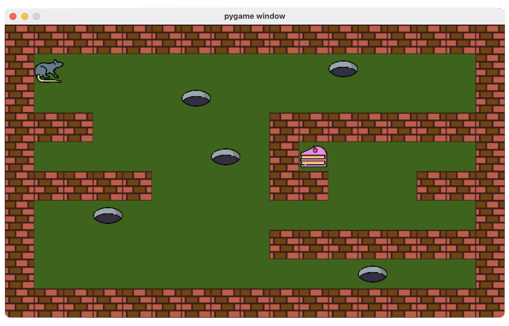
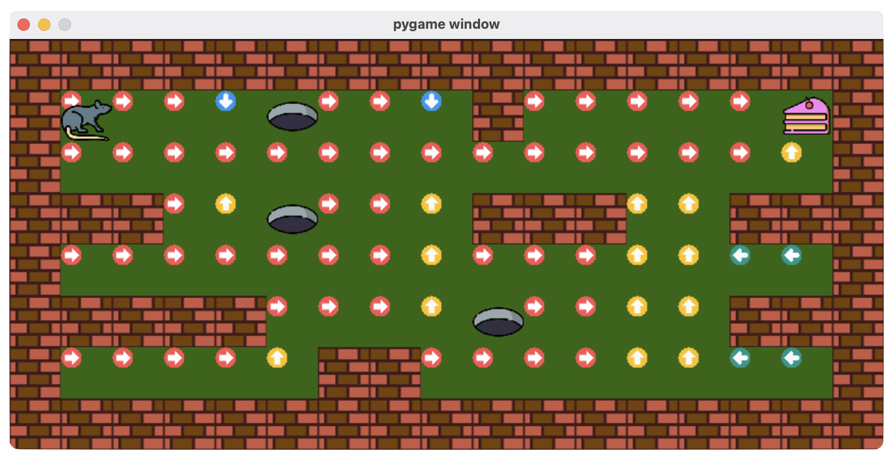
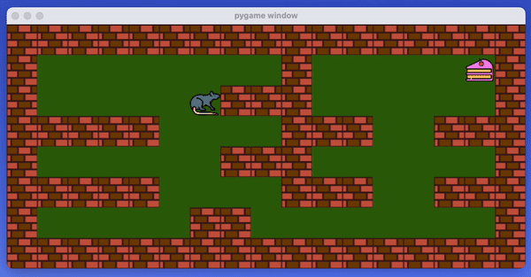

# GridWorld

Gridworld is a tool for easily producing custom grid environments to test model-based and model-free (only table-based) Reinforcement Learning algorithms. The package provides an uniform way of defining a grid-world and place agent and goal state. Further, it builds the transition probability matrix (P_sas) and the reward matrix (R_sa) from the defined environment to test planning algorithms. Moreover, for model-free algorithms, the package provides a openai-gym like interface to interact with the environment and explore.
<br clear="left"/>

# Installation
To install the package in your python(>=3.9) environment you need to run the below commands:
```bash
git clone https://github.com/prasenjit52282/GridWorld.git
cd GridWorld
python setup.py install
```

# Model-based
See how we define the custom-grid world "a" being agents location, "g" being the goal, "o" being holes, and "w" being walls to obstruct the agent. For a model-based setup we can access the transition and reward dynamics "P_sas" and "R_sa" as shown below.
```python
import numpy as np
from gridworld import GridWorld

world=\
    """
    wwwwwwwwwwwwwwwww
    wa   o   w     gw
    w               w
    www  o   www  www
    w               w
    wwwww    o    www
    w     ww        w
    wwwwwwwwwwwwwwwww
    """
    
env=GridWorld(world,slip=0.2) # Slip is the degree of stochasticity of the gridworld.

# Value Iteratioin
V=np.zeros((env.state_count,1))
V_prev=np.random.random((env.state_count,1))
eps=1e-7
gamma=0.9

while np.abs(V-V_prev).sum()>eps:
    Q_sa=env.R_sa+gamma*np.squeeze(np.matmul(env.P_sas,V),axis=2)
    V_prev=V.copy()
    V=np.max(Q_sa,axis=1,keepdims=True)
    pi=np.argmax(Q_sa,axis=1)

print("Pi:",pi)
env.show(pi)  # Show the policy in graphical window and we can control the agent using the arrow-keys
```
The policy is shown below:
```
Pi: [0, 0, 0, 1, 0, 0, 0, 1, 0, 0, 0, 0, 0, 3, 0, 0, 0, 0, 0, 0, 0, 0,
     0, 0, 0, 0, 0, 0, 3, 0, 3, 0, 0, 0, 3, 3, 3, 0, 0, 0, 0, 0, 0, 0,
     3, 0, 0, 0, 3, 3, 2, 2, 0, 0, 0, 3, 0, 0, 0, 3, 3, 0, 0, 0, 0, 3,
     0, 0, 0, 0, 3, 3, 2, 2]

# where mapping is {0:'right',1:'down',2:'left',3:'up'}
```


# Model-Free
See how we define the custom-grid world "a" being agents location, "g" being the goal, "o" being holes, and "w" being walls to obstruct the agent. For a model-free setup we can interact with the environment with a openai-gym like interface and observe the <S,A,R,S'> tuples as shown below.
```python
import time
import numpy as np
from gridworld import GridWorld

world=\
    """
    wwwwwwwwwwwwwwwww
    wa       w     gw
    w      www      w
    wwwww    www  www
    w      www      w
    wwwww    www  www
    w     ww        w
    wwwwwwwwwwwwwwwww
    """
    
env=GridWorld(world,slip=0.2,max_episode_step=1000) # Beyond max_episode_step interaction, agent get a timelimit error

for i in range(100): # Number of episodes
    curr_state=env.reset()
    done=False
    while not done:
        env.render() # [Optional] only if you want to monitor the progress
        action=env.random_action() # Select by the agent's policy
        next_state,reward,done,info=env.step(action) # Openai-gym like interface
        print(f"<S,A,R,S'>=<{curr_state},{action},{reward},{next_state}>")
        curr_state=next_state
        time.sleep(0.1) # Just to see the actions
env.close() # Must close when rendering is enabled
```
State Transitions are printed:
```
<S,A,R,S'>=<0,1,-1,14>
<S,A,R,S'>=<14,1,-1,15>
<S,A,R,S'>=<15,1,-1,14>
<S,A,R,S'>=<14,1,-1,14>
<S,A,R,S'>=<14,0,-1,15>
<S,A,R,S'>=<15,1,-1,15>
<S,A,R,S'>=<15,3,-1,1>
<S,A,R,S'>=<1,3,-1,1>
<S,A,R,S'>=<1,3,-1,1>
<S,A,R,S'>=<1,1,-1,15>
<S,A,R,S'>=<15,3,-1,1>
<S,A,R,S'>=<1,3,-1,1>
<S,A,R,S'>=<1,3,-1,1>
 ....
# Each state is uniquely identified by state ID (e.g., o, 1, 2, ...)
```


# Examples
To elaborate the usage of the package, examples folder contains several classical Reinforcement Learning algorithms that is tested on this platform. The algorithms are as follow:

* Policy Evaluation 
    > ```python examples/policy_eval.py```
* Policy Iteration 
    > ```python examples/policy_itr.py```
* Value Iteration 
    > ```python examples/value_itr.py```
* Safe Monti-Carlo 
    > ```python examples/safe_mc.py```
* Safe SARSA 
    > ```python examples/safe_sarsa.py```

The underlined gridworld environment object is defined in "examples/gridenv.py", and the logs of each algorithm is getting stored in the "logs" folder.

# File Structure
If you want to have your own agent and goal along with differnt objects to represent the wall and normal states, you can change the respective images in "/gridworld/modules/images"
```
assets
examples
    └── gridenv.py
    └── helper.py
    └── policy_eval.py
    └── policy_itr.py
    └── value_itr.py
    └── safe_mc.py
    └── safe_sarsa.py
gridworld
    └── modules
        └── images
            └── agent.png
            └── goal.png
            └── wall.png
            └── {direction}.png
        └── __init__.py
        └── agent.py
        └── goal.py
        └── state.py
        └── wall.py
    └── __init__.py
    └── gridworld.py
logs
requirements.txt
.gitignore
LICENSE
MANIFEST.in
setup.py
test.py
```

# Contact Me
This is Assignment 1 of CS60077: Reinforcement Learning course in IIT Kharagpur, taught by Dr. Aritra Hazra. I hope that the gridworld tool will be useful in your RL-journey. For questions and general feedback, contact [Prasenjit Karmakar](https://www.linkedin.com/in/prasenjit52282).