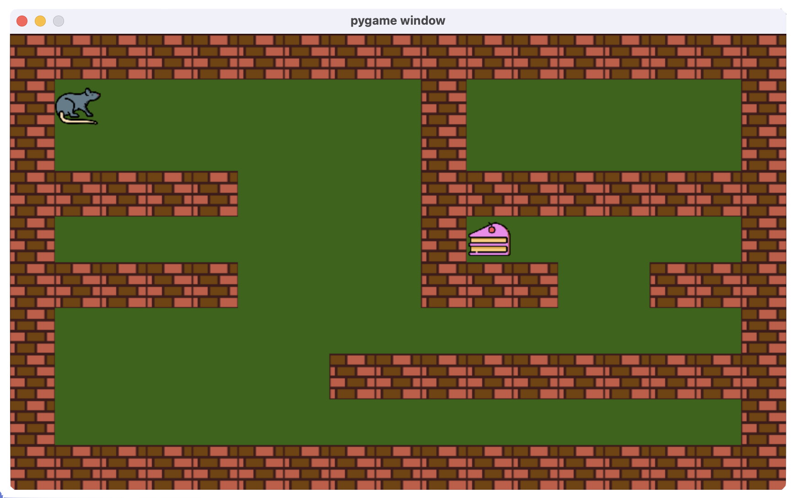
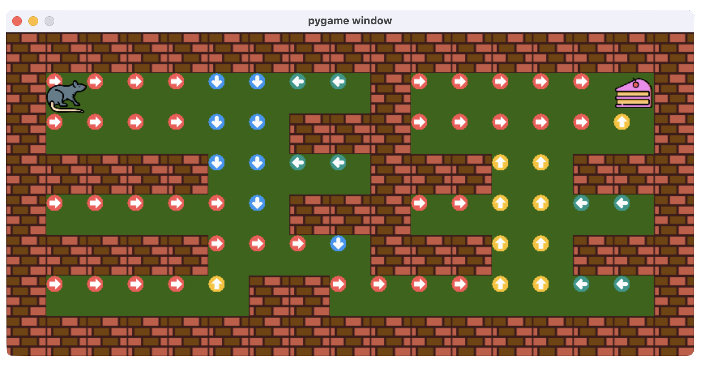

# GridWorld

Gridworld is a tool for easily producing custom grid environments to test model-based and model-free (only table-based) Reinforcement Learning algorithms. The package provides an uniform way of defining a grid-world and place agent and goal state. Further, it builds the transition probability matrix (P_sas) and the reward matrix (R_sa) from the defined environment to test planning algorithms. Moreover, for model-free algorithms, the package provides a openai-gym like interface to interact with the environment and explore.
<br clear="left"/>

# Installation
To install the package in your python(>=3.9) environment you need to run the below commands:
```
git clone https://github.com/prasenjit52282/GridWorld.git
cd GridWorld
python setup.py install
```

# File Structure
If you want to have your own agent and goal along with differnt objects to represent the wall and normal states, you can change the respective images in "/gridworld/modules/images"
```
- gridworld
    └── modules
        └── images
            └── agent.png
            └── goal.png
            └── wall.png
            └── {direction}.png
        └── __init__.py
        └── agent.py
        └── goal.py
        └── state.py
        └── wall.py
    └── __init__.py
    └── gridworld.py
- requirements.txt
- .gitignore
- LICENSE
- MANIFEST.in
- setup.py
- test.py
```
# Model-based
See how we define the custom-grid world "a" being agents location, "g" being the goal, and "w" being walls to obstruct the agent. For a model-based setup we can access the transition and reward dynamics "P_sas" and "R_sa" as shown below.
```python
import numpy as np
from gridworld import GridWorld

world=\
    """
    wwwwwwwwwwwwwwwww
    wa       w     gw
    w      www      w
    wwwww    www  www
    w      www      w
    wwwww    www  www
    w     ww        w
    wwwwwwwwwwwwwwwww
    """
    
env=GridWorld(world,slip=0.2)

# Policy Iteratioin
V=np.zeros((env.state_count,1))
V_prev=np.random.random((env.state_count,1))
eps=1e-7
gamma=0.9

while np.abs(V-V_prev).sum()>eps:
    Q_sa=env.R_sa+gamma*np.squeeze(np.matmul(env.P_sas,V),axis=2)
    V_prev=V.copy()
    V=np.max(Q_sa,axis=1,keepdims=True)
    pi=np.argmax(Q_sa,axis=1)

print("Pi:",pi)
env.show(pi)  # Show the policy in graphical window
```
The policy is shown below:
```
Pi: [0 0 0 0 1 1 2 2 0 0 0 0 0 3 0 0 0 0 1 1 0 0 0 0 0 3 1 1 2 2 3 3 0 0 0 0 0
 1 0 0 3 3 2 2 0 0 0 1 3 3 0 0 0 0 3 0 0 0 0 3 3 2 2]

# where mapping is {0:'right',1:'down',2:'left',3:'up'}
```



